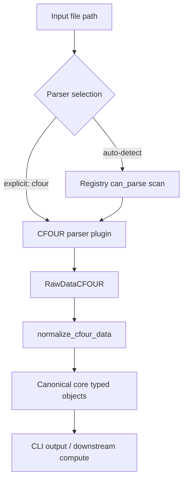
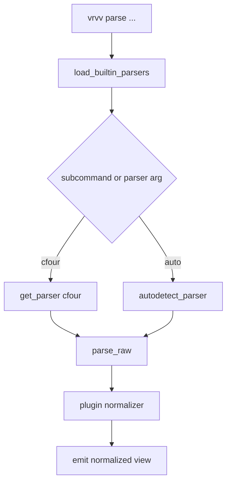

# Parser Plugin Architecture and CLI Flow

This document describes a target architecture for parser plugins and how CLI commands should use them.
It is intended to guide implementation, even where code is still a stub.

## Goals

- Keep **parse** and **normalize** as separate steps.
- Allow multiple parser backends (CFOUR now, others later).
- Keep CLI orchestration thin and backend-agnostic.
- Make parser selection work in both explicit and automatic modes.

## Layer Responsibilities

- `vrvv/ingest/<plugin>/parser.py`: read source files and return plugin-specific **raw** typed objects.
- `vrvv/ingest/<plugin>/raw.py`: plugin-specific raw dataclasses/types.
- `vrvv/ingest/<plugin>/normalize.py`: map raw plugin data into canonical `vrvv.core` typed objects.
- `vrvv/ingest/base.py`: parser protocol/interface.
- `vrvv/ingest/registry.py`: parser registration, lookup, and auto-detection.
- `vrvv/cli/commands/parse.py`: CLI orchestration only.

## Data Flow

## Registry Responsibilities

`vrvv/ingest/registry.py` should be the single place that answers:

- What parsers are available?
- Which parser is selected by name?
- Which parser matches a file in auto mode?

Recommended API shape:

- `register_parser(parser: ParserPlugin) -> None`
- `get_parser(name: str) -> ParserPlugin`
- `autodetect_parser(path: Path) -> ParserPlugin`
- `list_parsers() -> list[str]`
- `load_builtin_parsers() -> None`

### Selection rules

- **Explicit mode** (`vrvv parse cfour <path>`): use `get_parser("cfour")`.
- **Auto mode** (`vrvv parse auto <path>` or similar): use `autodetect_parser(path)`.
- Auto-detect must fail loudly when:
  - no parser matches, or
  - multiple parsers match ambiguously.

## CLI Command Structure (Target)

## Error Handling Guidelines

- Raise clear, user-facing errors for unknown parser names.
- Raise explicit ambiguity errors for auto-detect collisions.
- Keep parser exceptions descriptive (include file path and relevant section context).
- Do not silently fallback to a different parser.

## Why this structure helps

- Parsers stay focused on source-format extraction.
- Normalization remains reusable and testable in isolation.
- CLI remains stable even as plugins grow.
- Adding a new parser does not require changes in `core` or `compute`.
