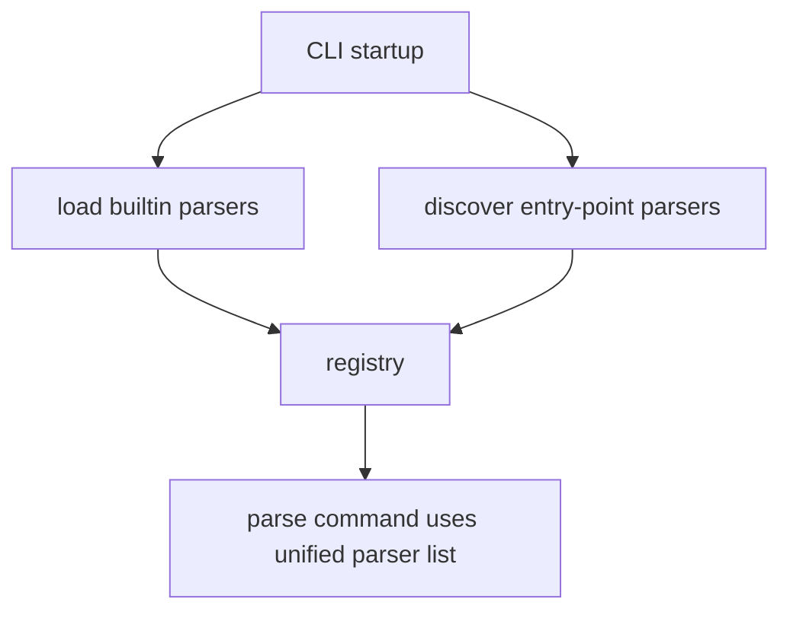

# Writing and Registering a Parser Plugin

This guide describes the intended workflow for adding a new ingest plugin to `vrvv`.
Use it as an implementation checklist.

## 1. Create plugin package structure

Create a new folder under `vrvv/ingest/`:

```text
vrvv/ingest/<plugin_name>/
  __init__.py
  raw.py
  parser.py
  normalize.py
```

Example for CFOUR:

```text
vrvv/ingest/cfour/
  raw.py
  parser.py
  normalize.py
```

## 2. Define plugin-specific raw typed objects

In `raw.py`, define dataclasses for values extracted directly from source files.

Guidelines:

- Keep field names close to source terminology.
- Keep units as found in source output.
- Avoid canonical reshaping here.

## 3. Implement parser logic

In `parser.py`, implement a plugin object that satisfies the parser protocol from `vrvv/ingest/base.py`.

Expected behavior:

- `name`: short plugin key (e.g., `"cfour"`).
- `can_parse(path)`: lightweight format detection.
- `parse_raw(path)`: parse file and return raw typed object.

## 4. Implement normalization

In `normalize.py`, convert raw plugin data into canonical core types.

Guidelines:

- Perform unit conversions here.
- Perform shape/field mapping here.
- Keep conversion deterministic and explicit.

## 5. Register the plugin

Register built-in plugins in `vrvv/ingest/registry.py`, typically in a bootstrapping function such as `load_builtin_parsers()`.


Registration requirements:

- Parser names must be unique.
- Duplicate names should raise a clear error.

## 6. Wire CLI command usage

For an explicit parser command (e.g., `vrvv parse cfour <file>`):

1. Call `load_builtin_parsers()`.
2. Resolve plugin with `get_parser("cfour")`.
3. Parse raw data with `parse_raw(path)`.
4. Normalize with plugin normalizer.
5. Render/report results.

## 7. Add tests and fixtures

Suggested layout:

```text
tests/
  fixtures/
    <plugin_name>/
      happy_path.out
      variant_format.out
      malformed.out
  ingest/
    <plugin_name>/
      test_parser.py
      test_normalize.py
```

Test split:

- `test_parser.py`: extraction correctness and parser failure modes.
- `test_normalize.py`: canonical mapping and unit conversion correctness.

## 8. Optional future extension: third-party plugins

After built-ins are stable, support external plugins via package entry points:

- Third-party package publishes parser class/function.
- `registry` discovers and registers at startup.
- CLI receives those parsers automatically through the same registry flow.



This keeps built-in and external plugins on the same execution path.
